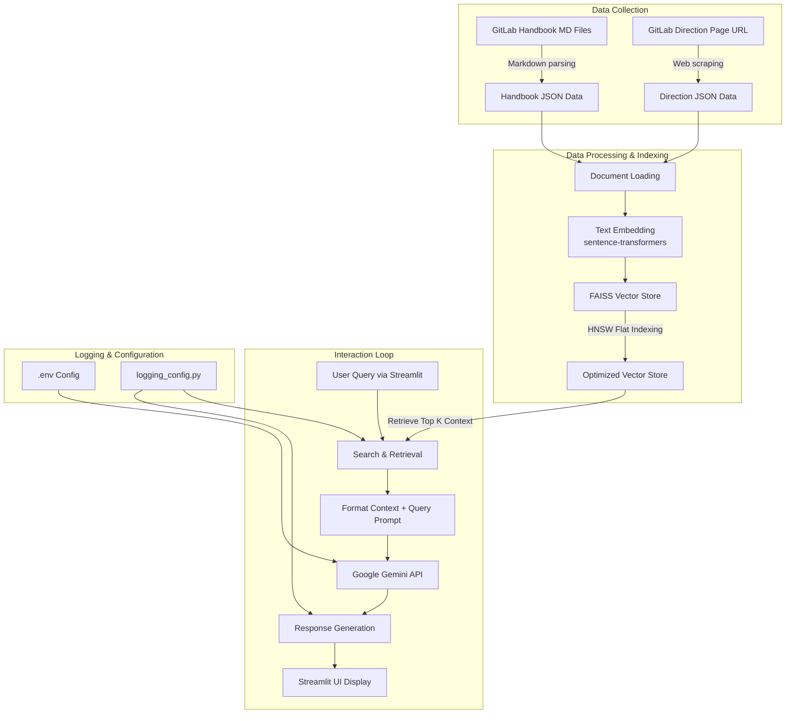

# GitLab Handbook & Direction Chatbot

An interactive, AI-powered chatbot designed to answer queries based on context retrieved from GitLab's Handbook and Direction pages. This project utilizes Retrieval-Augmented Generation (RAG) by preprocessing documentation, computing dense vector embeddings, indexing them using FAISS with HNSW, and generating natural responses via the Google Gemini API.

---

## 🚀 Key Features

- **Retrieval-Augmented Generation (RAG)**: Combines document search with generative AI to ensure answers are strictly grounded in GitLab's handbook and direction data.
- **Hybrid Data Parsing**: 
  - **GitLab Handbook**: Parses over 3,000 Markdown pages using `markdown-it-py` for clean structural tokenization.
  - **GitLab Direction Page**: Scrapes and extracts structured sections from HTML using `BeautifulSoup`.
- **Fast Vector Store Retrieval**:
  - Uses `sentence-transformers/all-MiniLM-L6-v2` for dense vector embeddings.
  - Implements **FAISS (Facebook AI Similarity Search)** with **HNSW (Hierarchical Navigable Small World)** indexing for millisecond-level semantic searches.
  - Employs `ThreadPoolExecutor` for parallel embedding creation.
- **Interactive UI**: Clean and simple Chat interface built using Streamlit.
- **Robust System Logging**: Tracks details of parser runs, vector database indexing, and query search/generation times in a dedicated log.

---

## 📋 Architecture & Data Flow



---

## 📁 Project Structure

Here is the directory structure of the repository:

- 📂 [core/](file:///d:/Projects/genai-chatbot/core) - Core modules for RAG, parsing, and LLM orchestration
  - 📄 [chatbot_core_gemini.py](file:///d:/Projects/genai-chatbot/core/chatbot_core_gemini.py) - Manages Gemini API integration, prompt construction, and response generation.
  - 📄 [data_retrieval_direction.py](file:///d:/Projects/genai-chatbot/core/data_retrieval_direction.py) - Scrapes and converts the GitLab direction HTML page to JSON.
  - 📄 [data_retrieval_handbook.py](file:///d:/Projects/genai-chatbot/core/data_retrieval_handbook.py) - Parses Markdown files in the handbook directory to header-content JSON format.
  - 📄 [logging_config.py](file:///d:/Projects/genai-chatbot/core/logging_config.py) - Configures file and stream logging for diagnostics.
  - 📄 [retrieval_langchain.py](file:///d:/Projects/genai-chatbot/core/retrieval_langchain.py) - Prepares documents, creates/loads FAISS vector stores, configures HNSW, and runs semantic searches.
- 📂 [data/](file:///d:/Projects/genai-chatbot/data) - JSON datasets representing handbook and direction contents
  - 📄 `direction_from_web.json` - Parsed direction page data.
  - 📄 `handbook_from_md.json` - Parsed handbook markdown data.
- 📂 [utils/](file:///d:/Projects/genai-chatbot/utils) - Helper utilities
  - 📄 [helpers.py](file:///d:/Projects/genai-chatbot/utils/helpers.py) - Placeholder for utility helper functions.
- 📂 [vector_stores/](file:///d:/Projects/genai-chatbot/vector_stores) - Locally cached FAISS index files for handbook and direction data.
- 📄 [app.py](file:///d:/Projects/genai-chatbot/app.py) - Main entrypoint to launch the Streamlit frontend.
- 📄 [requirements.txt](file:///d:/Projects/genai-chatbot/requirements.txt) - Python dependency list.
- 📄 [Chatbot_Documentation.pdf](file:///d:/Projects/genai-chatbot/Chatbot_Documentation.pdf) - PDF documentation detailing design decisions, learning points, and challenges.

---

## 🛠️ Setup & Installation

Follow these steps to set up and run the application locally:

### 1. Prerequisites
Ensure you have Python 3.9+ installed on your system.

### 2. Clone the Repository
```bash
git clone https://github.com/Vaibhavx-x/genai-chatbot.git
cd genai-chatbot
```

### 3. Create a Virtual Environment & Install Dependencies
Create a virtual environment and install the required libraries listed in [requirements.txt](file:///d:/Projects/genai-chatbot/requirements.txt):
```powershell
python -m venv .venv
.venv\Scripts\Activate.ps1   # On Windows
# source .venv/bin/activate  # On macOS/Linux

pip install -r requirements.txt
```

### 4. Configuration
Create a `.env` file in the root directory and add your Google Gemini API key:
```env
GEMINI_API_KEY=your_gemini_api_key_here
```

---

## 🏃 How to Run

### Data Preprocessing & Scraping (Optional)
If you want to update the parsed datasets, run the retrieval scripts:
```powershell
# Scrape the direction page from the web
python core/data_retrieval_direction.py

# Parse the markdown handbook files
python core/data_retrieval_handbook.py
```

### Launch the Chatbot
Start the Streamlit web interface:
```powershell
streamlit run app.py
```
This will open a local web server (typically at `http://localhost:8501`) where you can interact with the chatbot.

---

## 🧠 Key Technical Decisions

1. **Markdown vs. HTML Parsing for Handbook**:
   - Rather than scraping and parsing raw HTML for the 3,000+ GitLab handbook pages, we parsed the raw Markdown source files using `MarkdownIt` to maintain structured heading-paragraph pairs efficiently.
2. **all-MiniLM-L6-v2 Embeddings**:
   - Selected for its low resource footprint, fast execution times, and excellent semantic accuracy for English text.
3. **FAISS with HNSW (Hierarchical Navigable Small World)**:
   - Configured FAISS indexes using HNSW to guarantee low latency search retrieval on local CPU runs even as data size scales.
4. **Google Gemini 1.5 Flash API**:
   - Integrates the state-of-the-art `gemini-1.5-flash` model, ensuring high-quality, contextual summaries while respecting strict prompt instructions to avoid hallucinating facts outside of the retrieved context.

---

## ⚙️ Challenges & Solutions

- **Parsing Complex/Nested Markdown Structures**:
  - *Challenge*: GitLab's handbook uses highly nested configurations, custom elements, and multi-level heading structures.
  - *Solution*: Developed custom traversal logic using tokenized headers from `MarkdownIt` and filtered out noisy/unwanted HTML tags.
- **Large-scale Vector Storage Latency**:
  - *Challenge*: Generating and querying embeddings across millions of words can degrade response latency.
  - *Solution*: Cached the built FAISS vector store database locally to avoid reprocessing on subsequent runs, and optimized the search lookup with an HNSW flat index.

---

## 🔮 Future Enhancements

- **Result Caching**: Implement semantic caching for recurring queries to minimize API cost and latency.
- **Feedback Loop**: Provide interactive upvote/downvote buttons in the Streamlit UI to collect human feedback on chatbot answers.
- **Enhanced UI**: Add custom theme styling, formatting for citations, and expandable search results to show source text.
- **Cloud Deployment**: Containerize the app and deploy it on a cloud provider (e.g., GCP Run or Streamlit Cloud).
